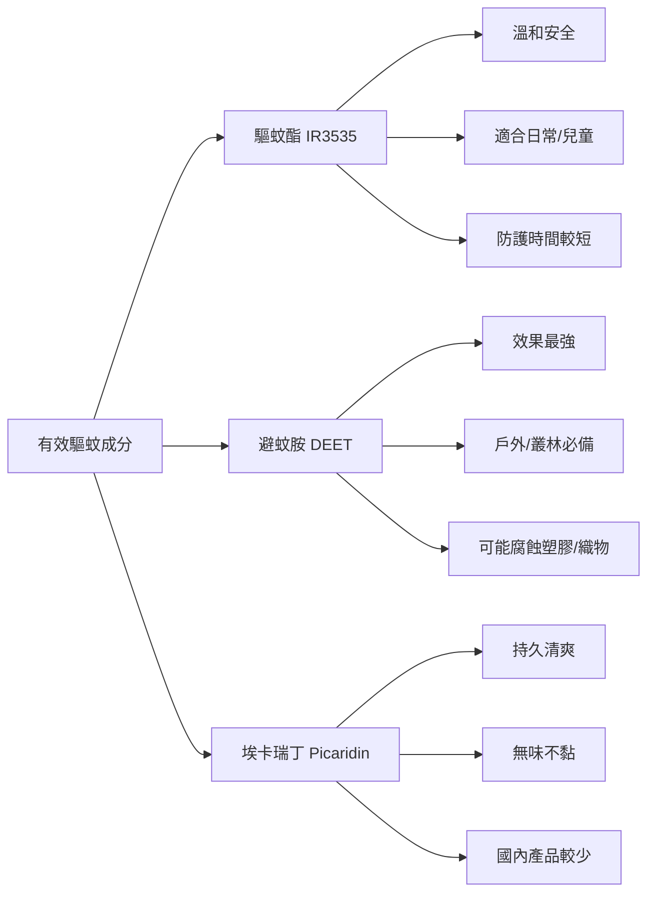

今年的夏天格外炎熱，蚊子也格外「猖狂」。近日，我所在地區出現的**基孔肯雅熱**病例，再次敲響了警鐘——這種通過**伊蚊**（白紋伊蚊、埃及伊蚊）傳播的病毒，可引發高燒、關節劇痛和皮疹，雖極少致命，但恢復期漫長，部分患者關節痛甚至持續數月。

防蚊，遠不止是為了止癢，更是為了防病。尤其在蚊媒傳染病仍流行的地區，科學防蚊——比如正確使用驅蚊產品、清理積水、安裝紗窗——至關重要。

⚠️ 注：下文針對的都是吸血的雌蚊。全文乾貨較多，可按小標題跳讀，歡迎收藏轉發。

---

### 1️⃣ 蚊子為什麼總咬我？

你身邊一定有那種「人形蚊香」：只要他在，蚊子就看不見別人。很多人歸因於「血型」，但科學上**蚊子並不能識別血型**。它們靠的是更強大的**嗅覺偵察系統**。

蚊子能在10–50米外就「聞」到你呼出的**二氧化碳**，並逆風飛向目標。當「嗡嗡聲」已在耳邊，說明它已進入近距離鎖定階段——此時它還能檢測到你汗液中的**乳酸**、**氨**等化學物質，再配合複眼對體溫和深色衣著的偏好，最終精準「下針」。

---

### 2️⃣ 蚊子是如何吸血的？

蚊子的嘴不像一根針，而是**六根**！包括：切開皮膚的上顎、固定用的下顎、注入口水的唾液管和吸血的「食管」。

整個過程堪比精密操作：
- 定位血管，切開皮膚；
- 注入含抗凝和麻醉成分的唾液；
- 一邊吸血，一邊排出多餘水分（是的，它邊吸邊尿…）。

---

### 3️⃣ 蚊子包到底是什麼？

又腫又癢的包，其實是你的身體在反擊。蚊子唾液中的蛋白質被免疫系統判定為「入侵者」，立即釋放**組織胺**——它讓血管擴張、組織液滲出（腫），同時刺激神經產生**癢感**，催你：「注意！有敵情！」

---

### 4️⃣ 為什麼有些驅蚊產品好像沒什麼用？

從幾塊錢的蚊香，到幾十塊的驅蚊貼、上百元的超聲APP——哪些真有用？看懂原理，省錢又有效。

#### 🏠 室內防蚊首選

電蚊香液、蚊香片和盤蚊香，有效成分大多是**擬除蟲菊酯**（如氯氟醚菊酯、四氟甲醚菊酯），能擾亂蚊子的神經，讓其過度興奮直至死亡。

✅ 可以這樣做：

- 傳統蚊香置於上風口，保持通風；
- 空調房用電熱蚊香液/片，選定時款更安全；
- **家有孕婦、幼兒**：首選蚊帳、紗窗；必要時選四氟甲醚菊酯類產品（相對溫和）；
- 🐱 **特別注意**：**擬除蟲菊酯對貓有毒**，建議不在同一房間使用，用後徹底通風；
- 斷根清源：定期清理積水，讓蚊子無處產卵。

---

#### 🌳 戶外防蚊看這裡

驅蚊花露水、噴霧、手環琳瑯滿目。請注意：**在我國，驅蚊產品屬「農藥」範疇**，合規產品須有農藥登記證號（如「WP202100XX」）和「微毒」標識。

目前被國際認證有效的驅蚊成分主要有三種：

✅ **戶外實戰**建議：

- 小區散步、短時間外出：驅蚊酯類產品足夠；
- 野外露營、公園夜跑：推薦DEET或Picaridin；
- 驅蚊貼/手環：只有貼近皮膚的小範圍起效，全身防護力不足；
- ❌ 超聲波驅蚊APP：完全無效！❌ 灭蚊燈：只能在無人時誘捕，人在時反而招蚊。

---

### 🌙 小結：

防蚊本質上是人類與進化贏家之間的博弈。沒有一招通吃的神器，真正有用的始終是**老三樣**：清積水、裝紗窗、科學用藥。

如果非要推薦一個安心之選——我還是投**蚊帳**。它古老、簡單，卻永遠有效。願我們試用無數產品後，仍能酣睡於一頂蚊帳之下的寧靜夏夜。
